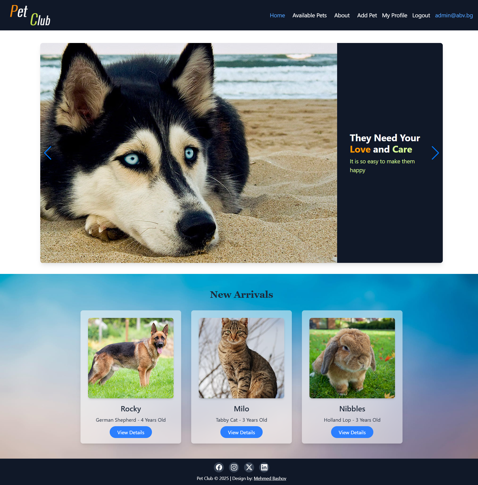
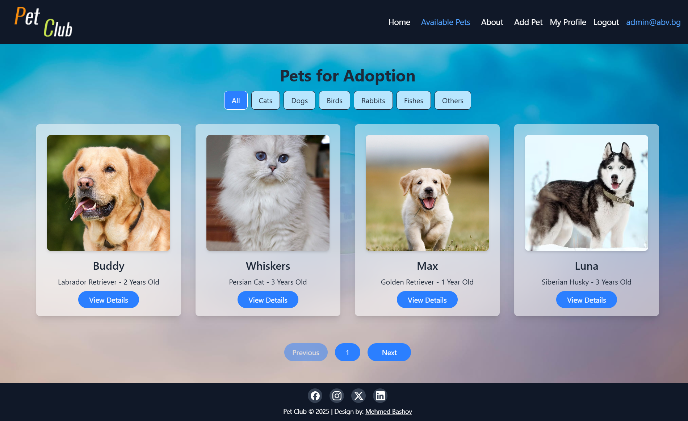
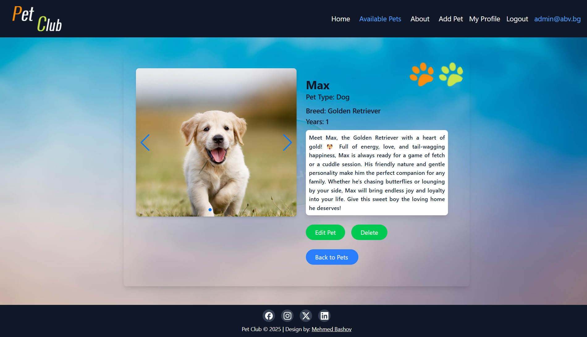
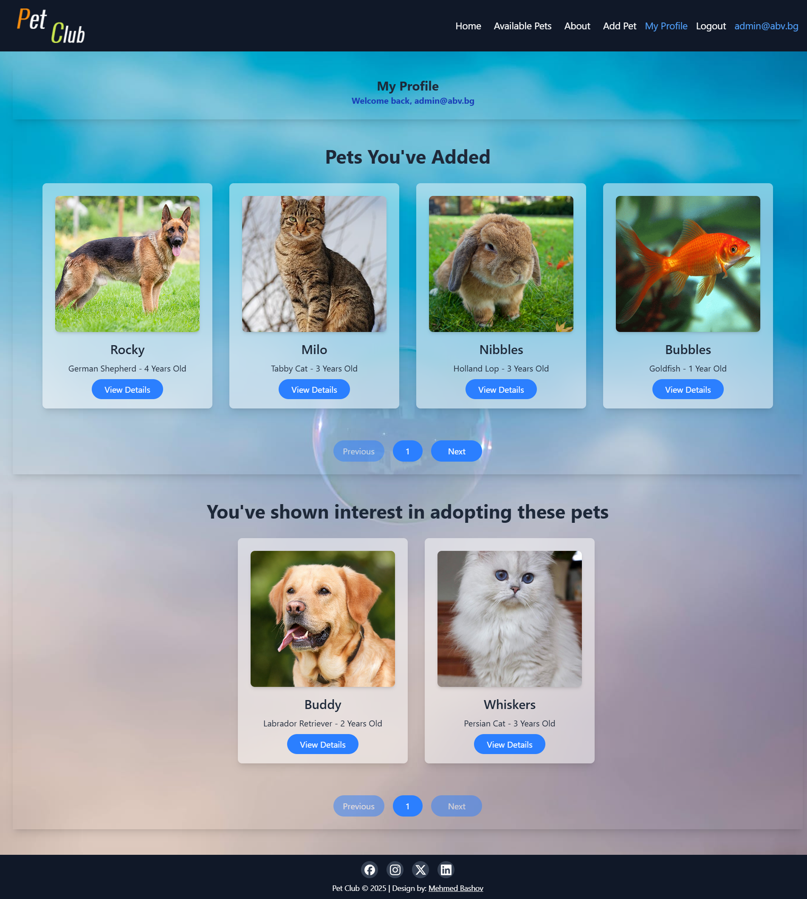

# 🐾 Pet Adoption Platform

## 📌 Overview
The **Pet Adoption Platform** is a web application that connects people with pets looking for a new home. Users can browse available pets, learn about the adoption process, and apply to adopt a pet. Registered users can manage their profiles, track adoption history, and submit adoption requests.

## 🚀 Features
### 🌍 Public Features (Accessible without authentication)
- **Browse Available Pets** – View a list of pets available for adoption (dogs, cats, etc.).
- **Pet Details Page** – Click on a pet to see detailed information, including:
  - Photos
  - Breed
  - Age
  - Type
- **Search & Filter Pets** – Filter pets based on type (dog, cat, etc.).
- **Adoption Process Info** – Read about the steps and requirements for adopting a pet.

### 🔒 Private Features (User Area)
- **User Registration/Login**
  - Create an account
  - Log in securely
- **User Profile**
  - View adoption applications
  - Manage added pets
- **Apply for Pet Adoption** – Fill out an adoption request form.
- **Pet Management**
  - Add new pets
  - Edit pet listings
  - Delete pet listings.

## 🛠 Tech Stack
### 🌐 Frontend
- **React.js** – Main UI framework
- **React Router** – Navigation between pages
- **Fetch API** – API calls for backend communication
- **JavaScript** – For creating dynamic content 

### 💾 Backend
- **SoftUni Practice Server** – Used for backend functionality
  > ⚠️ **Note:** This database is **not persistent**, meaning all user data (registrations, pet listings, etc.) will be lost upon a server restart.
  
🔗 Learn more about the SoftUni Practice Server [here](https://github.com/softuni-practice-server/softuni-practice-server)   

## 🧪 Testing

Unit tests have been added to ensure the stability and correctness of key components.

- **Testing Framework**: Vitest
- **Test Coverage**: Includes tests for important functionality such as form validation, API requests, and component rendering
### Running Tests

To run the tests locally:

```sh
npm run test  
``` 

## ☁️ Deployment

The application is deployed using **Google Cloud Run** with containerized infrastructure:

- **Docker** – Used for containerizing the application.
- **Artifact Registry** – Stores built container images.
- **Google Cloud Run** – Hosts and runs the containerized application.

The live app is accessible at:

🌐 [View Live Application](https://decisive-studio-457917-s8.web.app/)

---

### 📦 Continuous Integration

The project is configured with **GitHub Actions** for Continuous Integration (CI). On every merge to the main branch, the CI workflow automatically builds, tests, and deploys the latest changes to **Google Cloud Run**.

---

## 📦 Containerization & Deployment Process (Summary)

- **Docker**: A Dockerfile was created to build the server container.
- **Artifact Registry**: Container images are stored securely in Google Cloud Artifact Registry.
- **Cloud Run**: The containerized app is deployed to Cloud Run for scalable, serverless execution.

---

## 🏗 How to Run the Project
### 1️⃣ Clone the Repository
```sh
git clone https://github.com/MBashov/Pet-Adoption-Platform
```
### 2️⃣ Install Dependencies & Start the Frontend
```sh
cd ./client/
npm install
npm run dev
```
The app will run at [http://localhost:5173](http://localhost:5173).

### 3️⃣ Running the Backend
```sh
cd ./server/
node server.js
```


## 🤝 Contributing
Contributions are welcome! Here’s how you can contribute:
1. Fork the repo and clone it locally.
2. Create a new branch for your feature or fix.
3. Run the tests locally with `npm run test` to ensure everything works.
4. Submit a pull request for review.


## Screenshots

- **Home Page:**

    

- **Catalog Page:**

    

- **Details Page:**
    
     

- **Profile Page:**
    
    